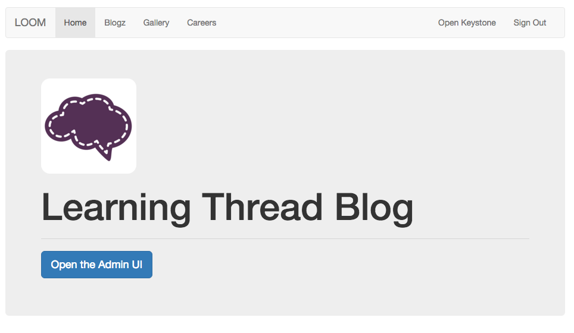

Loomblog!
===================

<p align="left">
  
</p>


The blog is created with `Keystone.js` & `Node.js`


# Get Started:
```sh
$ git clone [git-repo-url]
$ cd directory
$ npm install
$ node keystone.js
```
